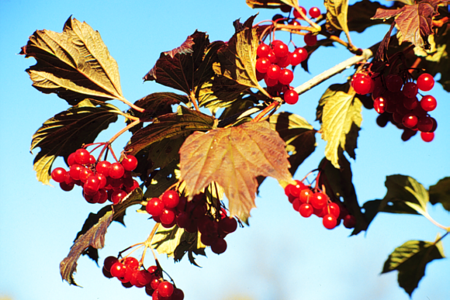

---
jupytext:
  formats: md:myst
  text_representation:
    extension: .md
    format_name: myst
    format_version: 0.13
    jupytext_version: 1.11.5
kernelspec:
  display_name: Python 3
  language: python
  name: python3
---

% #   <font color='#4B9DA9'> level 1 </font>
% ##  <font color='#547792'> level 2 </font>
% ### <font color='#E37434'> level 3 </font>
% {dropdown} <font color='#84B179'> Text </font>

#   <font color='#4B9DA9'> Rastrová grafika </font>


Do dokumentu môžeme vkladať rastrové obrázky v štandardných formátoch (*.bmp, *.png, *.jpg, *.gif) niekoľkými spôsobmi, pomocou direktív prostredia *Sphinx* alebo ako pri tworbe www stránok HTML tagom. Na {numref}`img0302a` je rastrový obrázok vo formáte *.bmp s upravenou veľkosťou, definovanou polohou v texte, priradenou referenciou a URL odkazom, ktorý sa otvorí po kliknutí na obrázok.

```{figure} ./img/PHOT0202.BMP
:alt: Kaktus
:name: img0302a
:align: center
:width: 350px
:target: https://en.wikipedia.org/wiki/Cactus

Obrázok vo formáte *.bmp s priradeným URL odkazom.
```
##  <font color='#547792'> Metódy vkladania rastrových obrázkov </font>

### <font color='#E37434'> *{image}* </font>

Direktíva **{image}** je určená pre vloženie obrázku do textu bez jeho popisu.

    ```{image} meno_súboru
    :name: string                 - referencia na obrázok
    :height: number               - výška v px
    :width: number                - šírka v px
    :scale: number                - škálovanie v %
    :align: string                - poloha left, center, right
    :target: string               - URL po kliknutí na obrázok
    :alt: text                    - alternatívny text ak aplikácia nemôže zobraziť obrázok
    ```

```{image} ./img/PHOT0173.BMP
:alt: kvet
:width: 350px
:align: center
```

<p>

Vložený obrázok bez popisného textu, je možné sa na neho odkazovať referenciou v parametri `name`. 

    
````{dropdown}  <font color='#84B179'> Použitie direktívy {image} </font>
    
Zobrazenie obrázku bez popisného textu. 

      ```{image} ./img/PHOT0173.BMP
      :alt: kvet
      :width: 350px
      :align: center
      ```


````

### <font color='#E37434'> *{figure}* </font>

Direktíva **{figure}** je určená pre vloženie obrázku do textu s popisom. Popis obrázku môže byť štandardný *Markdown* blok textu.

    ```{figure} súbor
    :name: string                 - referencia na obrázok
    :height: number               - výška v px
    :width: number                - šírka v px
    :scale: number                - škálovanie v %
    :align: string                - poloha left, center, right
    :target: string               - URL po kliknutí na obrázok
    :alt: text                    - alternatívny text ak aplikácia nemôže zobraziť obrázok
    
    Formátovaný popis obrázku
    ```

```{figure} ./img/img_eigen_01.gif
:alt: Elektromagnetické pole
:align: center

Zobrazenie animovaného GIF obrázku.
```
    
````{dropdown}  <font color='#84B179'> Použitie direktívy {figure} </font>
    
Zobrazenie obrázku s popisným textom. 

      ```{figure} ./img/img_eigen_01.gif
      :alt: Elektromagnetické pole
      :align: center

      Zobrazenie animovaného GIF obrázku.
      ```
````

### <font color='#E37434'> *{subfigure}* </font>

Rozšírenie [sphinx_subfigure](https://sphinx-subfigure.readthedocs.io/en/latest/) umožňuje ukladanie obrázkov do mriežky. 

Inštalácia rozšírenia

      pip install sphinx-subfigure
      
Konfigurácia v *conf.py* 

      extensions = ["sphinx_subfigure"]
      numfig = True  # optional

Formát direktívy

      ````{subfigure} format_mriežky
      :layout-sm: format_mriežky    - zobrazenie pre malé displeje
      :layout-lg: format_mriežky    - zobrazenie pre stredné displeje 
      :layout-xl: format_mriežky    - zobrazenie pre veľké displeje
      :layout-xxl: format_mriežky   - zobrazenie pre veľmi velké displeje
      :gap: number                  - medzera v px medzi obrázkami
      :subcaptions: position        - popis obrázkov above/below
      :name: string                 - referencia na obrázok
      :class-grid: outline
      :width: number                - šírka celéj mriežky obrázkov na stránke

      ```{image} file_A              - formát obrázku v mriežke 
         :alt: Image A               - parametre direktívy {image} s popisom
         ...
      ```
      ...                            - formáty nasledujúcich obrázkov
      
      text                           - popis celého obrázku s priradeným číslovaním 
      ````

Parameter *format_rastra* definuje formátovanie rastra obrázkov po riadkoch, jednotlivé riadky sú oddelené znakom `|`. Mriežka musí vytvárať obdĺžnikovú oblasť, chýbajúce obrázky sú vo formátovaní nahradené znakom `.`.

      {subfigure} ABC         [A] [B] [C]


      {subfigure} A|B|C           [A]
                                  [B]
                                  [C]
                             
  
      {subfigure} AB|CD       [A] [B]
                              [C] [D]
                           
                           
      {subfigure} AB|AC|AD        [B]
                              [A] [C]
                                  [D]
                                  
      {subfigure} .A.|BCD         [A]
                              [B] [C] [D]
 

````{subfigure} AB|CD
:layout-sm: A|B|C|D
:gap: 2px
:subcaptions: below
:width: 500px

```{image} ./img/PHOT0172.BMP
:alt: Image A
:width: 200px
```

```{image} ./img/PHOT0173.BMP
:alt: Image B
:width: 200px
```

```{image} ./img/PHOT0175.BMP
:alt: Image C
:width: 200px
```

```{image} ./img/PHOT0185.BMP
:alt: Image D
:width: 200px
```

Obrázky v rastri
````

 
`````{dropdown}  <font color='#84B179'> Použitie direktívy {subfigure} </font>

        ````{subfigure} AB|CD
        :layout-sm: A|B|C|D
        :gap: 2px
        :subcaptions: below
        :width: 500px

        ```{image} ./img/PHOT0172.BMP
        :alt: Image A
        :width: 200px
        ```

        ```{image} ./img/PHOT0173.BMP
        :alt: Image B
        :width: 200px
        ```

        ```{image} ./img/PHOT0175.BMP
        :alt: Image C
        :width: 200px
        ```

        ```{image} ./img/PHOT0185.BMP
        :alt: Image D
        :width: 200px
        ```
        
        Obrázky v rastri
        ````
`````


### <font color='#E37434'> *\* </font>

Pre vkladanie obrázkov do textu môžeme použiť [\](https://www.w3schools.com/tags/tag_img.asp) tag z HTML značkovacieho jazyka. 

      


<p>

</p>
Obrázok nie je možné popísať a nedá sa mu priradiť referencia.
<p>

</p>

````{dropdown}  <font color='#84B179'> Použitie tagu \ </font>

      
````


